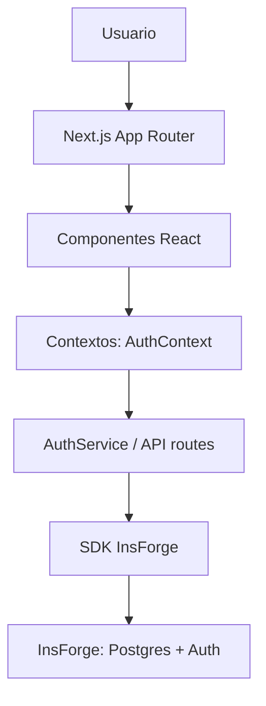

# 🏗️ Arquitectura del Sistema

> Diseño y patrones de TravelPal (repo `app-viajes`).

## Visión general

App web Next.js (App Router) con backend InsForge y despliegue en Cloudflare Workers. El código se
organiza por capas: UI (componentes/páginas), estado de cliente (contextos), API (route handlers y
server actions) y acceso a datos (SDK de InsForge).

### Stack

| Capa | Tecnología | Propósito |
|------|------------|-----------|
| Frontend | Next.js 16.3.5 + React 19 | Framework y UI |
| Lenguaje | TypeScript | Tipado estático |
| Estilos | Tailwind CSS | Diseño responsive |
| Backend | InsForge (`@insforge/sdk`) | Postgres + Auth + Storage |
| Hosting | Cloudflare Workers (`@opennextjs/cloudflare`) | Runtime y deploy |

### Estructura

```
src/
├── app/                  # App Router: páginas y API routes
│   └── api/              # Route handlers (auth/refresh, trips, expenses, ...)
├── components/           # UI por dominio (trips, notes, planning, ...)
├── contexts/             # AuthContext, ThemeContext
└── lib/
    ├── insforge.ts       # Cliente de navegador (createInsforgeClient)
    ├── insforge/
    │   ├── server.ts     # requireUser(), createServerInsforgeClient()
    │   ├── auth-actions.ts # Server actions de auth (createAuthActions)
    │   └── __tests__/    # Tests del servidor
    ├── auth.ts           # AuthService (usa las server actions)
    ├── public-env.ts     # Validación de variables públicas (zod)
    └── env.ts            # Validación de secretos de servidor (zod)
migrations/               # Esquema InsForge (fuente de verdad; ver ADR-004)
```

## Flujo de datos



En cliente, el acceso a datos va por `createInsforgeClient().database.from(...)`. En servidor, los
route handlers usan `requireUser()` y `client.database.from(...)`.

## Autenticación

- El navegador usa `createBrowserClient()` (auth de solo lectura) y refresca vía `/api/auth/refresh`.
- Las mutaciones (sign in/up/out, perfil, reset) corren en **server actions**
  (`src/lib/insforge/auth-actions.ts`) con `createAuthActions`, de modo que el refresh token se
  guarda como cookie httpOnly.
- `src/middleware.ts` llama a `updateSession()` para refrescar antes de renderizar.
- `requireUser()` (`src/lib/insforge/server.ts`) verifica la sesión con `getCurrentUser()` y
  devuelve `{ ok: true, client, user }` o `{ ok: false, response }` (401/500).

## Modelo de datos

Fuente de verdad única: `migrations/20260913181842_create-app-schema.sql` (ver ADR-004). Deriva de
las consultas reales y usa `text + CHECK` en vez de enums, con RLS de propietario (`auth.uid()`).

Tablas: `trips`, `expenses`, `notes`, `tasks`, `bookings`, `itinerary_activities`, `reminders`,
`calendar_events`, `alerts`, `budgets`, `profiles`, `users`. El detalle y el glosario están en
[CONTEXT.md](../CONTEXT.md).

## Configuración y entorno

- `src/lib/public-env.ts`: variables `NEXT_PUBLIC_*` (van al bundle del cliente).
- `src/lib/env.ts`: secretos de servidor (`INSFORGE_API_KEY`), nunca expuestos al cliente.
- En Cloudflare, `NEXT_PUBLIC_*` se inlinean en build y `INSFORGE_API_KEY` es un secreto de
  runtime (`wrangler secret put`). Ver ADR-003.

## CI

`.github/workflows/ci.yml` ejecuta en PR: `lint`, `type-check`, `test:ci`, `build` y un job
`worker-build` (`npx opennextjs-cloudflare build`, sin deploy). `commitlint.yml` valida los
mensajes de commit.

El job `build` ejecuta además `node scripts/check-data-paths.mjs` (etapa 0 del [#38]): congela el
recuento de los dos caminos de datos — llamadas al BFF por `/api` (`fetch` y `useApiResource`) y
puntos de uso del SDK de InsForge (`.database.from`) — y falla si aparece un `fetch` nuevo a un
endpoint de datos de usuario. El baseline por fichero y por dominio vive en
`scripts/data-paths-baseline.json` y se regenera con `--update` al borrar un endpoint.

[#38]: https://github.com/PabloJustDevelops/TravelPal/issues/38


## Decisiones

Ver `docs/DECISIONS/`: 002 (InsForge), 003 (Cloudflare), 004 (esquema desde el modelo TS). El
ADR-001 (adaptador de sesión sobre Supabase) queda como histórico.
